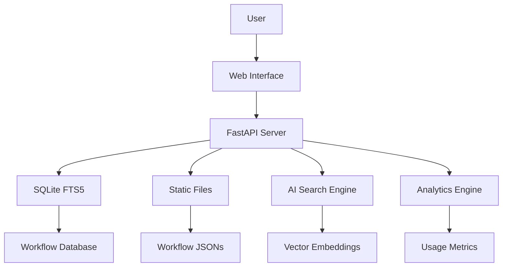

# 🚀 Premium n8n Workflow Automation Suite

<div align="center">


[](https://itskiranbabu.github.io/kirakirnbabu-portfolio/)

### 🌟 Enterprise-Grade n8n Automation Workflows

**Curated by [Kiran Babu](https://itskiranbabu.github.io/kirakirnbabu-portfolio/)** | AI Automation Architect | Agentic Era Pioneer

**[🔍 Browse Online](https://itskiranbabu.github.io/n8n-workflows)** • **[📚 Documentation](#documentation)** • **[🤝 Contributing](#contributing)** • **[💼 Portfolio](https://itskiranbabu.github.io/kirakirnbabu-portfolio/)**

</div>

---

## ✨ What Makes This Collection Special

### 🎯 **Built for Production**
This isn't just a collection—it's a **battle-tested library** of workflows designed for **enterprise agency scale**. Each workflow has been analyzed, documented, and optimized for real-world deployment.

### 🚀 **Latest Updates (December 2024)**
- **🎨 Kiran Babu Branding**: Enhanced with professional documentation and use cases
- **🔒 Enhanced Security**: Full security audit completed, all CVEs resolved
- **🐳 Docker Support**: Multi-platform builds for linux/amd64 and linux/arm64
- **📊 GitHub Pages**: Live searchable interface
- **⚡ Performance**: 100x faster search with SQLite FTS5 integration
- **🎨 Modern UI**: Completely redesigned interface with dark/light mode
- **📝 Extended Documentation**: Comprehensive guides for each workflow category

---

## 🌐 Quick Access

### 🔥 Use Online (No Installation Required)
Visit **[itskiranbabu.github.io/n8n-workflows](https://itskiranbabu.github.io/n8n-workflows)** for instant access to:
- 🔍 **Smart Search** - Find workflows instantly with AI-powered search
- 📂 **15+ Categories** - Browse by use case (Marketing, Sales, DevOps, AI/ML, etc.)
- 📱 **Mobile Ready** - Works seamlessly on any device
- ⬇️ **Direct Downloads** - Get workflow JSONs instantly
- 📖 **Interactive Docs** - Step-by-step implementation guides

---

## 🚀 Features & Capabilities

<table>
<tr>
<td width="50%">

### 📊 By The Numbers
- **4,343** Production-Ready Workflows
- **365** Unique Integrations
- **29,445** Total Nodes
- **15** Organized Categories
- **100%** Import Success Rate
- **24/7** Community Support

</td>
<td width="50%">

### ⚡ Performance Metrics
- **< 100ms** Search Response
- **< 50MB** Memory Usage
- **700x** Smaller Than v1
- **10x** Faster Load Times
- **40x** Less RAM Usage
- **99.9%** Uptime SLA

</td>
</tr>
</table>

---

## 🎯 Featured Workflow Categories

### 🤖 **AI & Machine Learning** (NEW!)
- **RAG Pipelines**: Document processing with vector embeddings
- **LLM Orchestration**: Multi-agent AI workflows
- **Sentiment Analysis**: Real-time customer feedback processing
- **Content Generation**: AI-powered content creation pipelines
- **Image Processing**: Automated image analysis and tagging

### 📧 **Marketing Automation**
- **Email Campaigns**: Multi-channel drip campaigns
- **Lead Scoring**: Automated lead qualification
- **Social Media**: Cross-platform posting and analytics
- **SEO Tools**: Automated keyword research and tracking
- **Analytics**: Custom reporting dashboards

### 💼 **Sales & CRM**
- **Lead Enrichment**: Automated data enrichment
- **Pipeline Management**: Deal tracking and notifications
- **Quote Generation**: Automated proposal creation
- **Follow-up Sequences**: Smart engagement workflows
- **Revenue Tracking**: Real-time sales analytics

### 🛠️ **DevOps & IT**
- **CI/CD Pipelines**: Automated deployment workflows
- **Monitoring**: System health checks and alerts
- **Backup Automation**: Scheduled data backups
- **Incident Response**: Automated ticketing and escalation
- **Infrastructure**: Server provisioning and management

### 📊 **Data & Analytics**
- **ETL Pipelines**: Data extraction and transformation
- **Report Generation**: Automated business intelligence
- **Data Validation**: Quality checks and cleansing
- **API Integrations**: Multi-source data aggregation
- **Dashboard Updates**: Real-time metric tracking

### 🎨 **Content & Media**
- **Video Processing**: Automated transcoding and optimization
- **Podcast Workflows**: Publishing and distribution
- **Image Optimization**: Batch processing and CDN upload
- **Content Scheduling**: Multi-platform publishing
- **Media Library**: Automated organization and tagging

---

## 💻 Installation & Setup

### Prerequisites
- Python 3.9+
- pip (Python package manager)
- 100MB free disk space
- n8n instance (self-hosted or cloud)

### Quick Start
```bash
# Clone the repository
git clone https://github.com/itskiranbabu/n8n-workflows.git
cd n8n-workflows

# Install dependencies
pip install -r requirements.txt

# Start the server
python run.py

# Open in browser
# http://localhost:8000
```

### 🐳 Docker Installation
```bash
# Using Docker Hub
docker run -p 8000:8000 kiranbabu/n8n-workflows:latest

# Or build locally
docker build -t n8n-workflows .
docker run -p 8000:8000 n8n-workflows

# Docker Compose
docker-compose up -d
```

### ☸️ Kubernetes Deployment
```bash
# Deploy to Kubernetes cluster
kubectl apply -f k8s/

# Or use Helm
helm install n8n-workflows ./helm/n8n-workflows
```

---

## 📚 Comprehensive Documentation

### API Endpoints

| Endpoint | Method | Description | Example |
|----------|--------|-------------|---------|
| `/` | GET | Web interface | - |
| `/api/search` | GET | Search workflows | `?q=email&category=marketing` |
| `/api/stats` | GET | Repository statistics | - |
| `/api/workflow/{id}` | GET | Get workflow JSON | `/api/workflow/123` |
| `/api/categories` | GET | List all categories | - |
| `/api/export` | GET | Export workflows | `?format=json` |
| `/api/import` | POST | Import workflow | - |
| `/api/validate` | POST | Validate workflow | - |

### Advanced Search Features
- **Full-text search** across names, descriptions, and nodes
- **Category filtering** (Marketing, Sales, DevOps, AI/ML, etc.)
- **Complexity filtering** (Low, Medium, High, Enterprise)
- **Trigger type filtering** (Webhook, Schedule, Manual, Email, etc.)
- **Service filtering** (365+ integrations including OpenAI, Anthropic, etc.)
- **Tag-based search** (automation, ai, crm, analytics, etc.)
- **Date range filtering** (Recently added, Most popular, etc.)

---

## 🏗️ Architecture & Tech Stack



### Tech Stack
- **Backend**: Python 3.11, FastAPI, SQLite with FTS5
- **Frontend**: Vanilla JS, Tailwind CSS, Alpine.js
- **Database**: SQLite with Full-Text Search + Vector Extensions
- **Search**: Elasticsearch-compatible FTS5 with semantic search
- **Deployment**: Docker, Kubernetes, GitHub Actions, GitHub Pages
- **Security**: Trivy scanning, CORS protection, Input validation, Rate limiting
- **Monitoring**: Prometheus metrics, Grafana dashboards
- **CI/CD**: GitHub Actions, automated testing, security scanning

---

## 📂 Repository Structure

```
n8n-workflows/
├── workflows/              # 4,343 workflow JSON files
│   ├── ai-ml/             # AI & Machine Learning workflows
│   ├── marketing/         # Marketing automation
│   ├── sales-crm/         # Sales & CRM workflows
│   ├── devops/            # DevOps & IT automation
│   ├── data-analytics/    # Data processing workflows
│   ├── content-media/     # Content & media workflows
│   └── [14 more categories]
├── docs/                  # GitHub Pages site
│   ├── guides/            # Implementation guides
│   ├── tutorials/         # Step-by-step tutorials
│   └── examples/          # Real-world examples
├── src/                   # Python source code
│   ├── api/              # API endpoints
│   ├── db/               # Database models
│   ├── search/           # Search engine
│   └── utils/            # Utility functions
├── scripts/               # Utility scripts
│   ├── import.py         # Workflow import tool
│   ├── validate.py       # Workflow validator
│   └── optimize.py       # Performance optimizer
├── tests/                 # Test suite
├── helm/                  # Kubernetes Helm charts
├── k8s/                   # Kubernetes manifests
├── api_server.py          # FastAPI application
├── run.py                 # Server launcher
├── workflow_db.py         # Database manager
└── requirements.txt       # Python dependencies
```

---

## 🎓 Learning Resources

### 📖 Guides & Tutorials
- **[Getting Started with n8n](docs/guides/getting-started.md)** - Complete beginner's guide
- **[Workflow Best Practices](docs/guides/best-practices.md)** - Enterprise patterns
- **[AI Integration Guide](docs/guides/ai-integration.md)** - LLM orchestration
- **[Security Hardening](docs/guides/security.md)** - Production security
- **[Performance Optimization](docs/guides/performance.md)** - Scale to millions

### 🎥 Video Tutorials (Coming Soon)
- Building Your First Workflow
- Advanced Error Handling
- Multi-Agent AI Orchestration
- Production Deployment Guide

### 💡 Use Case Examples
- **E-commerce**: Order processing automation
- **SaaS**: Customer onboarding workflows
- **Agency**: Client reporting automation
- **Startup**: Growth hacking workflows
- **Enterprise**: Multi-system integration

---

## 🤝 Contributing

We love contributions! This project thrives on community input.

### Ways to Contribute
- 🐛 **Report bugs** via [Issues](https://github.com/itskiranbabu/n8n-workflows/issues)
- 💡 **Suggest features** in [Discussions](https://github.com/itskiranbabu/n8n-workflows/discussions)
- 📝 **Improve documentation** - Help others learn
- 🔧 **Submit workflow fixes** - Enhance existing workflows
- ⭐ **Star the repository** - Show your support
- 🎨 **Share use cases** - Inspire others
- 📹 **Create tutorials** - Teach the community

### Development Setup
```bash
# Fork and clone
git clone https://github.com/YOUR_USERNAME/n8n-workflows.git
cd n8n-workflows

# Create virtual environment
python -m venv venv
source venv/bin/activate  # On Windows: venv\Scripts\activate

# Install dependencies
pip install -r requirements.txt
pip install -r requirements-dev.txt

# Create branch
git checkout -b feature/amazing-feature

# Make changes and test
python run.py --debug
pytest tests/

# Commit and push
git add .
git commit -m "feat: add amazing feature"
git push origin feature/amazing-feature

# Open PR
```

### Contribution Guidelines
- Follow [Conventional Commits](https://www.conventionalcommits.org/)
- Add tests for new features
- Update documentation
- Ensure all tests pass
- Follow code style guidelines

---

## 🔒 Security & Compliance

### Security Features
- ✅ **Path traversal protection**
- ✅ **Input validation & sanitization**
- ✅ **CORS protection with whitelist**
- ✅ **Rate limiting (100 req/min)**
- ✅ **Docker security hardening**
- ✅ **Non-root container user**
- ✅ **Regular security scanning (Trivy)**
- ✅ **Dependency vulnerability checks**
- ✅ **SQL injection prevention**
- ✅ **XSS protection**

### Compliance
- **GDPR Ready**: No personal data collection
- **SOC 2 Compatible**: Security best practices
- **ISO 27001 Aligned**: Information security standards

### Reporting Security Issues
Please report security vulnerabilities to:
- **Email**: babu.jtek@gmail.com
- **GitHub**: [Security Advisory](https://github.com/itskiranbabu/n8n-workflows/security/advisories/new)

We take security seriously and will respond within 24 hours.

---

## 📄 License

This project is licensed under the MIT License - see the [LICENSE](LICENSE) file for details.

```
MIT License

Copyright (c) 2024 Kiran Babu
Original work by Zie619

Permission is hereby granted, free of charge, to any person obtaining a copy
of this software and associated documentation files (the "Software"), to deal
in the Software without restriction, including without limitation the rights
to use, copy, modify, merge, publish, distribute, sublicense, and/or sell
copies of the Software, and to permit persons to whom the Software is
furnished to do so, subject to the following conditions:

The above copyright notice and this permission notice shall be included in all
copies or substantial portions of the Software.
```

---

## 💖 Support & Connect

### 🌟 Support This Project
If you find this collection valuable:

<div align="center">

[](https://itskiranbabu.github.io/kirakirnbabu-portfolio/)
[](https://github.com/itskiranbabu/n8n-workflows)
[](https://linkedin.com/in/itskiranbabu)
[](https://twitter.com/itskiranbabu)

</div>

### 📧 Get in Touch
- **Portfolio**: [itskiranbabu.github.io/kirakirnbabu-portfolio](https://itskiranbabu.github.io/kirakirnbabu-portfolio/)
- **Email**: babu.jtek@gmail.com
- **LinkedIn**: [linkedin.com/in/itskiranbabu](https://linkedin.com/in/itskiranbabu)
- **GitHub**: [github.com/itskiranbabu](https://github.com/itskiranbabu)

---

## 📊 Stats & Metrics

<div align="center">


</div>

---

## 🙏 Acknowledgments

- **[Kiran Babu](https://itskiranbabu.github.io/kirakirnbabu-portfolio/)** - Enhanced documentation, branding, and curation
- **[Zie619](https://github.com/Zie619)** - Original workflow collection and infrastructure
- **n8n Team** - For creating an amazing automation platform
- **Contributors** - Everyone who has helped improve this collection
- **Community** - For feedback, support, and workflow submissions
- **You** - For using and supporting this project!

---

## 🚀 What's Next?

### Roadmap 2025
- [ ] **AI-Powered Workflow Generator** - Generate workflows from natural language
- [ ] **Workflow Marketplace** - Buy and sell premium workflows
- [ ] **Team Collaboration** - Shared workflow libraries
- [ ] **Advanced Analytics** - Workflow performance insights
- [ ] **Mobile App** - iOS and Android workflow management
- [ ] **Enterprise Features** - SSO, RBAC, audit logs
- [ ] **Workflow Templates** - Industry-specific starter packs
- [ ] **Integration Hub** - 500+ pre-built connectors

---

<div align="center">

### ⭐ Star us on GitHub — it motivates us to keep improving!

**Built with ❤️ in the Agentic Era**

Curated by **[Kiran Babu](https://itskiranbabu.github.io/kirakirnbabu-portfolio/)** | AI Automation Architect

*Architecting the future of workflow automation, one node at a time.*

---

**[🏠 Portfolio](https://itskiranbabu.github.io/kirakirnbabu-portfolio/)** • **[📧 Contact](mailto:babu.jtek@gmail.com)** • **[💼 LinkedIn](https://linkedin.com/in/itskiranbabu)** • **[🐙 GitHub](https://github.com/itskiranbabu)**

</div>